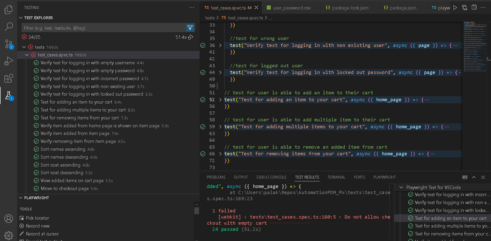

**Playwright + TypeScript E2E Automation Framework**
This is a modern, scalable end-to-end test automation framework designed using TypeScript and Playwright for automating the UI testing of an e-commerce web application.

**✅ Key Highlights**
🔧 Tech Stack:
    TypeScript for type safety and maintainability
    Playwright for cross-browser, cross-device UI automation

📁 **Modular Architecture:**
    Implements the Page Object Model (POM) for a clean separation between test logic and page interactions.
    Includes a BasePage class and helper utilities for common reusable functionality.
    Configurable for both desktop and mobile views with custom device settings.

🧠 **Clean & Readable Test Structure:**
    Test cases are grouped logically using test.describe() for better organization.
    Constants (like test data and item names) are centralized for easier updates and improved clarity.
    Asynchronous operations are handled properly with await to ensure reliable execution.

**📦 Core Testing Scenarios Covered:**
    Cart Functionality: Add/remove single or multiple items, cart persistence checks
    Product Page Validations: Item detail navigation and cart interaction
    Checkout Process: Validation of form fields, successful transactions, error messages
    Sorting & Filtering: Verifying ascending/descending order for name and price
    Login Scenarios: Full coverage of edge cases including empty fields, locked accounts, and invalid credentials

**✔️ Best Practices Followed:**
    Clear and consistent test naming
    Reusable page methods and test data
    Readable assertions and concise test steps
    Minimal duplication with centralized configuration and data

